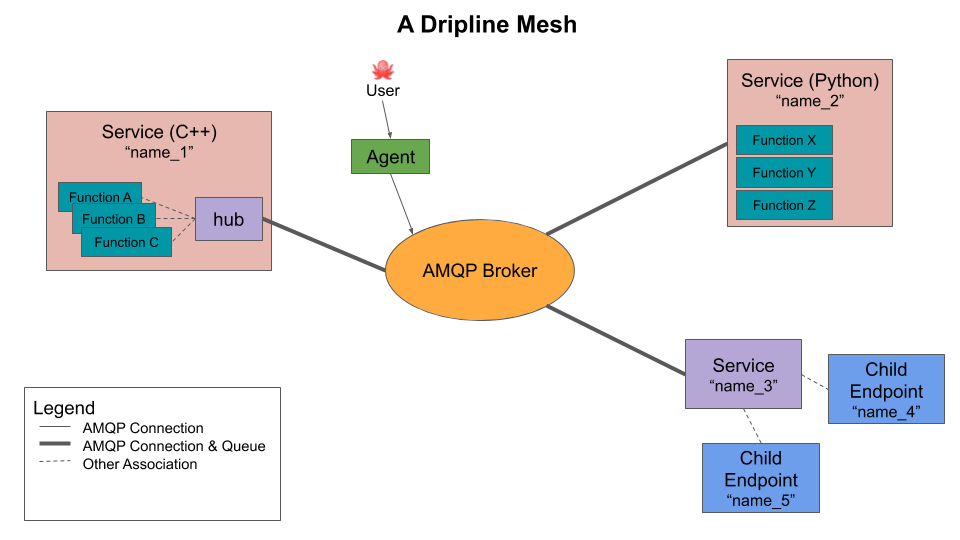

============
Architecture
============

Dripline is a protocol for a controls framework aimed at medium-sized experiments, where one wants a distributed and flexible controls system.  A full dripline-based system is called a "mesh," and it comprises a number of different types of components, including the broker, endpoints, and services.  A user typically interacts with the mesh via an agent.  Each part of the system will be described in its own section below.

Since the mesh is built on an AMQP network, it may be useful to review the `AMQP model <https://www.rabbitmq.com/tutorials/amqp-concepts.html>`_.

.. _mesh:

The Mesh
========

A full dripline system is called a "mesh."  The main components of a mesh are a AMQP broker and any number of producers and consumers of messages.  At the most basic level, agents send requests to endpoints, which can send back replies, and messages are directed to their destination via a broker.

The instruments and pieces of software that are part of the controls system are represented by "endpoints" and "services."  Endpoints and services give the instruments and software the interface they need to communicate using a common communications protocol.  They can receive requests from users, and send replies back (and they can make requests to each other).  They can also send alert-message broadcasts to the entire mesh.

Users are represented by an "agent," which can send messages to anything on the mesh, and receive replies to requests.

.. _broker:

AMQP Broker
===========

The central element of a dripline mesh is the AMQP broker.  The broker is responsible for directing messages from sender to receiver.  Specifically the broker has a set of exchanges for receiving messages and a set of queues for distributing messages.  Message consumers--in the dripline case these are endpoints and services--are responsible for binding a particular exchange to a particular queue using a routing key.

While the dripline standard does not require a particular implementation of AMQP, the official dripline implementation uses RabbitMQ.

.. _endpoint:

Endpoint
========

An *endpoint* is the basic message receiver in a mesh.  The endpoint will take the appropriate action in reponse to a request, and send a reply back.

Endpoints are typically owned by a :ref:`service <service>`.  They may operate *syncronously* with the service, in which case they receive messages from the service, or *asynchronously*, in which case they directly consume messages from their own AMQP queue.  A synchronous endpoint responds to requests using its service's thread.  An asynchronous endpoint has its own threads that it uses to consume and respond to requests.

.. _agent:

Agent
=====

An *agent* is the primary way in which users interact with a mesh.  A user can send a message to any component of the mesh, and receive replies.

.. _service:

Service
=======

The primary unit of software that connects with the broker is the *service*.  A service will typically correspond to a single instrument (e.g. power supply) or piece of software, and it might have one or more child endpoints.  The service is responsible for maintaining its connection with the AMQP broker, and organizing and operating its child endpoints.

The service, which is itself an endpoint, has an AMQP queue from which it consumes messages.  The routing key used is the service's *name*.  The service has *synchronous* child endpoints that recieve messages on the service's queue.  The service is reponsible for distributing messages to the synchronous endpoints according to their routing keys.  The service also has *asynchronous* child endoints that receive messages on their own queues.

.. _operating-a-mesh:

Operating a Mesh
================

While the dripline standard specifies *what* can go in a mesh, it does not specify *how* a mesh is deployed.  The dripline developers recommend the use of containers and a deployment menthod like ``docker-compose`` or Kubernetes.

The first thing to be deployed should be the broker.  

Next, the services that will be used should be deployed, configured so that they connect to the broker.  For basic functionality as a controls system, those services might include the relevant instruments and pieces of software, a database for storing values, and a logging service to record data in the database.

Finally, the user can use the agent (``dl-agent`` in the official implementation) to send messages.  The official implementation also includes ``dl-mon`` to allow users to monitor the messages being passed back and forth in the mesh.

